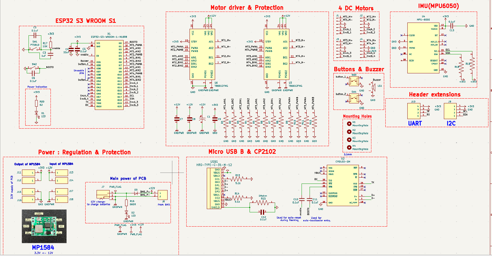
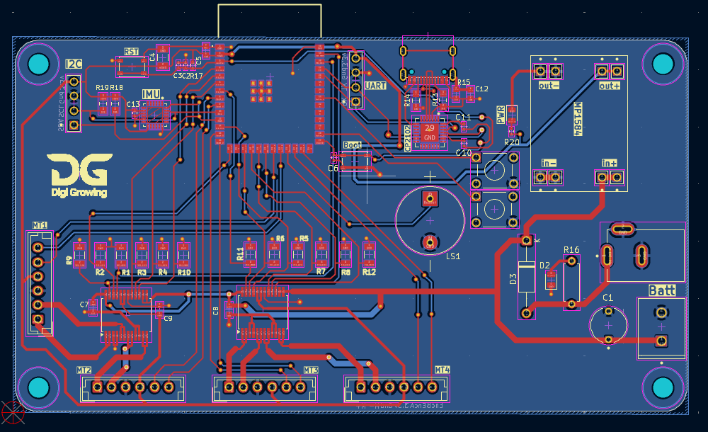
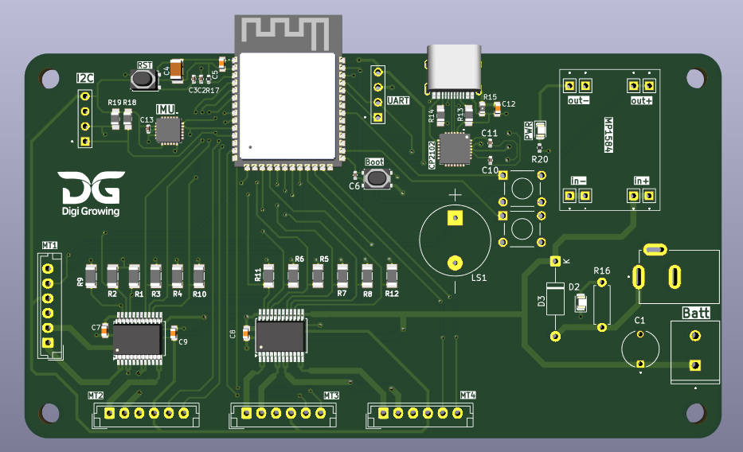

# 🤖 Embedded Mobile Robot

### Overview
Designed a custom motor controller PCB and integrated it into a robotics platform with ROS2.  
Implemented visual SLAM with OAK-D Lite and evaluated multiple mapping strategies on Raspberry Pi and Jetson.

### Features
- Fabrication-ready ESP32-S3 motor controller PCB
- Integrated encoder feedback and MPU6050 IMU
- Real-time 3D mapping using ROS2 with OAK-D Lite
- Benchmarked **Visual SLAM vs LiDAR SLAM**
- Scalable architecture for robotics research and prototyping

### Tech Stack
ESP32-S3, Altium Designer, ROS2, OAK-D Lite, Raspberry Pi, Jetson, Python, SLAM

### Media
- 📸 PCB Schematic: 
- 📸 PCB Layout (2D): 
- 📸 PCB 3D Render: 
- 🎥 [Demo Video 1 – Mapping](https://youtu.be/dddd)
- 🎥 [Demo Video 2 – Mapping](https://youtu.be/eeee)

### Contributions
- Designed and tested custom motor controller PCB
- Integrated IMU + encoder 
- Implemented ROS2 visual SLAM pipeline on Raspberry Pi
- Optimized mapping for both Pi and Jetson platforms
